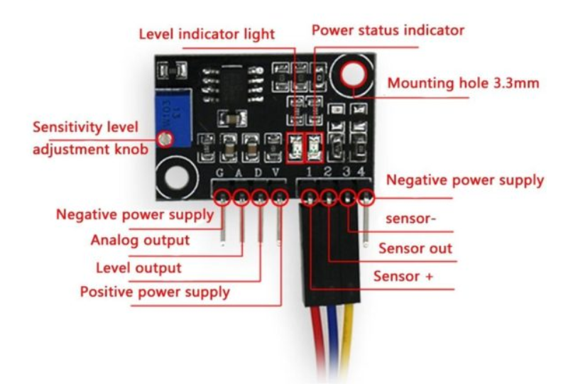

# Turbidity Sensor Test Sketch
Created by Faranux Team

## 📖 Overview
This project implements a turbidity sensor test sketch using an Arduino Uno. It measures water turbidity by reading analog voltage from the sensor and converting it to NTU (Nephelometric Turbidity Units) using a calibrated formula. The system provides real-time voltage and turbidity readings through the Serial Monitor.

## ✨ Features
- Real-time turbidity measurement in NTU
- Analog voltage reading and conversion
- Serial Monitor output for data logging
- Simple and effective water quality monitoring
- Calibrated formula for accurate NTU calculation

## 🧰 Components Required
| Component                | Quantity |
|--------------------------|----------|
| Arduino Uno Rev3         | 1        |
| Turbidity Sensor Module  | 1        |
| Turbidity Probe          | 1        |
| Jumper Wires             | Several  |
| Breadboard (optional)    | 1        |

## 🛠️ Pin Configuration
| Turbidity Sensor | Arduino Pin |
|------------------|-------------|
| A (Analog)       | A0          |
| G (Ground)       | GND         |
| V (Power)        | 5V          |

| Turbidity Module | Turbidity Probe |
|------------------|-----------------|
| 1                | Red             |
| 2                | Blue            |
| 3                | Yellow          |

## 🔌 Circuit Diagram


> *Ensure proper connection between the turbidity module and probe. The sensor requires 5V power for accurate readings.*

## ⚙️ How It Works
1. The turbidity sensor outputs an analog voltage proportional to water clarity
2. Arduino reads the analog value from pin A0
3. Voltage is calculated: `voltage = 0.004888 * analogRead(SENSOR)`
4. Turbidity is calculated using the formula: `turbidity = -1120.4 * voltage² + 5742.3 * voltage - 4352.9`
5. Valid readings are displayed when voltage ≥ 2.5V and turbidity ≥ 0 NTU
6. Results are printed to Serial Monitor every 500ms

## Installation
1. Clone this repository:
```bash
git clone https://github.com/faranux-electronics/product-testing-codes.git
```
2. Connect the components according to the pin configuration
3. Upload the provided Arduino code to your Arduino Uno
4. Open Serial Monitor (baud rate: 9600)
5. Insert the turbidity probe into water to test

## Serial Monitor Output
The system provides real-time turbidity readings:
```
Voltage =2.67 V Turbidity =123.45 NTU
Voltage =2.71 V Turbidity =118.32 NTU
Voltage =2.65 V Turbidity =128.91 NTU
```

## Usage
- Clean the turbidity probe before and after use
- Calibrate the sensor for different water types if needed
- Monitor readings through Serial Monitor
- Higher NTU values indicate more turbid (cloudy) water
- Lower NTU values indicate clearer water

## NTU Reference Values
| Water Type              | NTU Range    |
|-------------------------|--------------|
| Clear Water             | 0-50 NTU     |
| Slightly Turbid         | 50-100 NTU   |
| Moderately Turbid       | 100-200 NTU  |
| Highly Turbid           | 200+ NTU     |

## Troubleshooting
| Problem                   | Solution                              |
|---------------------------|---------------------------------------|
| No readings in Serial     | Check baud rate is set to 9600        |
| Incorrect readings        | Verify 5V power connection            |
| Negative turbidity values | Sensor not properly calibrated        |
| Voltage always 0V         | Check A0 pin connection               |

## Safety Notes
- ⚠️ Ensure proper voltage levels (5V) for the sensor
- ⚠️ Do not exceed maximum sensor voltage rating
- ⚠️ Clean the probe with distilled water after use
- ⚠️ Avoid submerging the sensor module in water
- ⚠️ Handle electronic components carefully

## Calibration
The provided formula is pre-calibrated for most turbidity sensors. For precise measurements:
1. Test with known turbidity standards
2. Adjust the formula coefficients if needed
3. Create a calibration curve for your specific sensor

## Contributing
1. Fork the repository
2. Create your feature branch
3. Commit your changes
4. Push to the branch
5. Create a new Pull Request

## License
This project is open-source and available under the MIT License.

## Authors
- Faranux Team

## Version History
- (2025-07-16): Initial release
